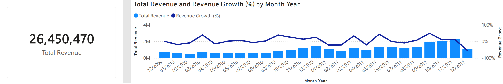
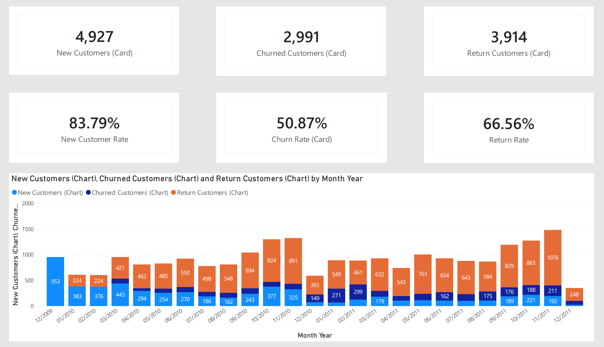

# 📊 Customer Analytics: RFM Segmentation & Churn Analysis

## 📌 Project Overview
This project analyzes customer behavior in an e-commerce business using RFM segmentation and customer lifecycle metrics (New, Returning, Churn).

The objective is to understand key growth drivers, identify retention issues, and provide data-driven recommendations to improve long-term business performance.

---

## 🎯 Objectives
- Analyze customer lifecycle: New, Returning, and Churn
- Segment customers using RFM (Recency, Frequency, Monetary)
- Evaluate revenue distribution across customer groups
- Identify key drivers of business growth and retention issues

---

## 📊 Dataset
- Online Retail dataset (UK-based e-commerce)
- Time range: Dec 2009 – Dec 2011
- ~36,000+ transactions | ~5,800 customers

---

## 🧹 Data Cleaning
- Removed cancelled orders (Invoice starting with "C")
- Filtered out negative quantity values
- Removed null Customer IDs
- Standardized date format for time-based analysis  

---

## 🧠 Methodology

### 1. Customer Lifecycle Analysis
- **New Customers**: First-time buyers within a given period  
- **Returning Customers**: Customers who repurchase after a gap  
- **Churned Customers**: No purchase after 90 days

---

### 2. RFM Segmentation
- Recency: How recently a customer purchased  
- Frequency: Number of purchases  
- Monetary: Total spending  

RFM Score:
- Calculated using percentile-based scoring (1–5 scale)

---

## 📈 Key Visualizations

### 📊 Revenue & Growth Trend
  
→ Shows overall growth trend and seasonality (peak in Q4)

---

### 👥 Customer Lifecycle Distribution
  
→ Highlights imbalance between acquisition and retention

---

### 💰 Revenue by Customer Segment (RFM)
📌 *[Insert bar chart: Revenue by RFM segment]*  
→ Identifies high-value segments (Champions)

---

### 📉 Churn Trend
📌 *[Insert line or card: Churn rate over time]*  
→ Tracks customer drop-off behavior

---

### 📊 AOV & Purchase Frequency
📌 *[Insert chart: AOV & Frequency trends]*  
→ Explains drivers behind revenue growth

---

## 🔍 Key Insights

- Business growth is heavily driven by **new customers**, while retention remains weak
- **Churn rate is high (~50%)**, indicating poor customer retention
- Revenue is highly concentrated in **Champions (~60–70%)**
- Large portion of customers fall into **At Risk / Lost segments**  
- Growth is **seasonal and unstable**, peaking in Q4  

---

## 💡 Recommendations

### 1. Improve Customer Retention
- Focus on reducing churn instead of relying on acquisition  
- Implement CRM and loyalty programs  

---

### 2. Maximize High-Value Customers
- Retain Champions with personalized offers  
- Provide exclusive benefits and early access  

---

### 3. Convert Loyal → Champions
- Upsell and cross-sell strategies  
- Encourage higher AOV  

---

### 4. Re-engage At-Risk Customers
- Remarketing campaigns  
- Discount or incentive-based return strategies  

---

### 5. Reduce Revenue Dependency Risk
- Diversify customer base  
- Avoid over-reliance on a small segment  

---

## 🛠 Tools Used
- SQL / Excel (data cleaning & preparation)  
- Power BI (data visualization & dashboard)  

---

## 📈 Outcome
Developed a customer segmentation model and identified key retention issues, providing actionable insights to improve business growth and sustainability.

---

## 👤 Author
Nguyen Le Duc Tri  
Role: Data Analyst
